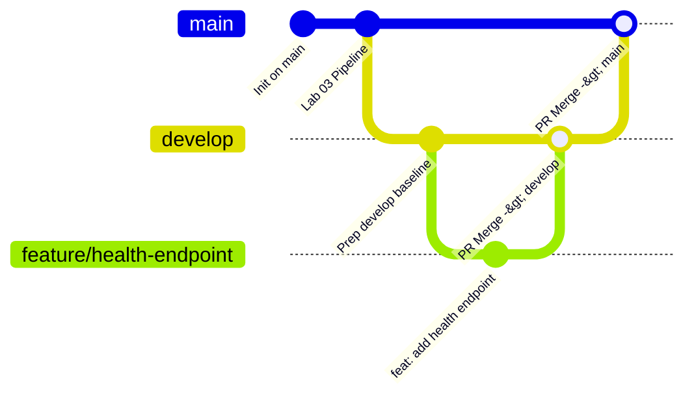

# Lab 04 — Multibranch Pipeline Branch Strategy & Execution Matrix

This document provides the branch strategy diagram and stage execution matrix required for **Lab 04 — Git, GitHub & Multibranch Pipelines**.

---

## 1. Branch Strategy Diagram (Feature → Develop → Main)



### Detailed Flow & Stage Execution Architecture

```mermaid
flowchart TD
    subgraph FeatureBranch["Branch: feature/health-endpoint (or PR into develop)"]
        direction TB
        F_Push["Push Commit / Open PR"] --> F_Install["Stage: Install ✅"]
        F_Install --> F_Lint["Stage: Lint ✅"]
        F_Lint --> F_Test["Stage: Unit Test ✅"]
        F_Test --> F_Staging["Stage: Deploy — Staging ⏭️ SKIPPED<br/>(when { branch 'develop' } = false)"]
        F_Staging --> F_Prod["Stage: Deploy — Production ⏭️ SKIPPED<br/>(when { branch 'main' } = false)"]
    end

    subgraph DevelopBranch["Branch: develop (Staging Environment)"]
        direction TB
        D_Merge["Merge PR from feature/health-endpoint"] --> D_Install["Stage: Install ✅"]
        D_Install --> D_Lint["Stage: Lint ✅"]
        D_Lint --> D_Test["Stage: Unit Test ✅"]
        D_Test --> D_Staging["Stage: Deploy — Staging 🚀 RUNS<br/>(echo deploying to staging--.)"]
        D_Staging --> D_Prod["Stage: Deploy — Production ⏭️ SKIPPED<br/>(when { branch 'main' } = false)"]
    end

    subgraph MainBranch["Branch: main (Production Environment)"]
        direction TB
        M_Merge["Merge develop into main"] --> M_Install["Stage: Install ✅"]
        M_Install --> M_Lint["Stage: Lint ✅"]
        M_Lint --> M_Test["Stage: Unit Test ✅"]
        M_Test --> M_Staging["Stage: Deploy — Staging ⏭️ SKIPPED<br/>(when { branch 'develop' } = false)"]
        M_Staging --> M_Input["⏸️ Input Step: 'Deploy to production?'<br/>Pauses execution for manual approval"]
        M_Input -->|Approved by Admin| M_Prod["Stage: Deploy — Production 🚢 RUNS<br/>(echo deploying to production--.)"]
        M_Input -->|Aborted| M_Abort["Build Aborted / Stopped"]
    end

    FeatureBranch -->|Pull Request Approval & Merge| DevelopBranch
    DevelopBranch -->|Release PR & Merge| MainBranch

    classDef runStage fill:#d4edda,stroke:#28a745,stroke-width:2px,color:#155724;
    classDef skipStage fill:#e2e3e5,stroke:#6c757d,stroke-width:1px,stroke-dasharray: 5 5,color:#383d41;
    classDef pauseStage fill:#fff3cd,stroke:#ffc107,stroke-width:2px,color:#856404;

    class F_Install,F_Lint,F_Test,D_Install,D_Lint,D_Test,D_Staging,M_Install,M_Lint,M_Test,M_Prod runStage;
    class F_Staging,F_Prod,D_Prod,M_Staging skipStage;
    class M_Input pauseStage;
```



---

## 2. Stage Execution Comparison Matrix

| Stage | `feature/health-endpoint` | `PR-*` (Pull Request) | `develop` (Staging) | `main` (Production) | Condition / Gate Mechanism |
| :--- | :---: | :---: | :---: | :---: | :--- |
| **Install** | ✅ Runs | ✅ Runs | ✅ Runs | ✅ Runs | Always runs (`npm ci`) |
| **Lint** | ✅ Runs | ✅ Runs | ✅ Runs | ✅ Runs | Always runs (`npm run lint`) |
| **Unit Test** | ✅ Runs | ✅ Runs | ✅ Runs | ✅ Runs | Always runs (`npm test`) |
| **Deploy — Staging** | ⏭️ Skipped | ⏭️ Skipped | 🚀 **Runs (Automatic)** | ⏭️ Skipped | `when { branch 'develop' }` |
| **Deploy — Production** | ⏭️ Skipped | ⏭️ Skipped | ⏭️ Skipped | ⏸️ **Pauses for Input** ➡️ 🚢 **Runs** | `when { beforeInput true; branch 'main' }` + `input` prompt |

---

## 3. Jenkins Declarative Pipeline Code Reference

```groovy
        stage('Deploy — Staging') {
            when {
                branch 'develop'
            }
            steps {
                script { env.CURRENT_STAGE = env.STAGE_NAME }
                sh 'echo deploying to staging--.'
            }
        }

        stage('Deploy — Production') {
            when {
                beforeInput true
                branch 'main'
            }
            input {
                message 'Deploy to production?'
            }
            steps {
                script { env.CURRENT_STAGE = env.STAGE_NAME }
                sh 'echo deploying to production--.'
            }
        }
```

> **Engineering Note on `beforeInput true`**:  
> In Jenkins Declarative Pipeline, an `input` directive declared within a stage is evaluated **before** stage conditions (`when`) by default. Specifying `beforeInput true` ensures Jenkins evaluates `branch 'main'` first, preventing non-main branches (such as `develop` and feature branches) from stalling on an unintended production approval prompt.
