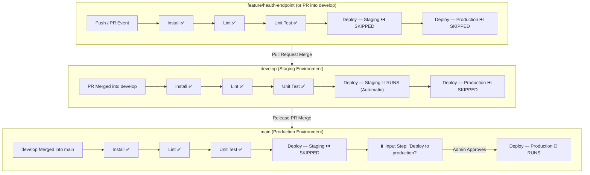

# Lab 04 — Git, GitHub & Multibranch Pipelines Step-by-Step Guide

This guide walks through every step required to complete **Lab 04: Multibranch Pipeline with GitHub Webhook and Stage Gating**.

---

## Deliverables Summary

1. **Deliverable 1**: Screenshot of the GitHub webhook delivery log showing a `200` response.
2. **Deliverable 2**: A one-diagram branch strategy (`feature → develop → main`) annotated with which stage runs on each (provided in [`lab04_branch_strategy.md`](file:///c:/Users/Devasipason/Desktop/subject/moblie%20app/subscription_track/doc/devops/lab04_branch_strategy.md) and inline below).

---

## Part 1: Start Jenkins & Expose via Tunnel (ngrok)

> **Important**: Per Rule 3 in `AGENTS.md`, background services like Docker containers and tunnels are started manually by the user.

### Step 1.1: Start Jenkins Container
In PowerShell, start the existing Jenkins container:
```powershell
docker start jenkins
```
Verify that Jenkins is running and reachable on `http://localhost:8080`.

### Step 1.2: Expose Jenkins with ngrok (or alternative tunnel)
In a new terminal window, run:
```powershell
ngrok http 8080
```
*(If ngrok is not installed, install via `winget install Ngrok.Ngrok` or use cloudflared: `cloudflared tunnel --url http://localhost:8080`).*

Copy the public HTTPS forwarding URL from ngrok:
Example: `https://xxxx-xx-xx-xx-xx.ngrok-free.app`

---

## Part 2: Configure GitHub Webhook

1. Open your repository on GitHub:
   `https://github.com/nawaphonST1/subscription_track`
2. Navigate to: **Settings** → **Webhooks** → click **Add webhook**.
3. Fill in the webhook form:
   - **Payload URL**: `https://<YOUR-NGROK-DOMAIN>/github-webhook/`  
     *(⚠️ The trailing slash `/` at the end is **mandatory** for Jenkins)*
   - **Content type**: `application/json`
   - **Secret**: *(leave blank unless configured in Jenkins GitHub plugin)*
   - **SSL verification**: Enable SSL verification
   - **Which events would you like to trigger this webhook?**:  
     Select **"Let me select individual events."**  
     - ✅ Check **Pushes**
     - ✅ Check **Pull requests**
   - **Active**: Ensure checkbox is checked.
4. Click **Add webhook**.
5. **Deliverable 1 Capture**:
   - GitHub immediately sends a `ping` event.
   - Click on the newly created webhook and look under **Recent Deliveries**.
   - You will see a delivery with a green checkmark and status **200**.
   - Take a screenshot of this delivery log showing the **200 OK** response.

---

## Part 3: Configure Multibranch Pipeline in Jenkins

1. Go to Jenkins: `http://localhost:8080`
2. Click **New Item**:
   - Item Name: `subscription-track-multibranch` (or `taskflow-multibranch`)
   - Select: **Multibranch Pipeline**
   - Click **OK**.
3. Under **Branch Sources**:
   - Click **Add source** → select **GitHub** (or **Git**).
   - **Repository HTTPS URL**: `https://github.com/nawaphonST1/subscription_track.git`
   - **Credentials**: Select your GitHub Personal Access Token credentials (created in Lab 02/03).
   - **Behaviors**:
     - *Discover branches* (Strategy: All branches).
     - *Discover pull requests from origin* (Strategy: Merging the pull request with the current target branch revision).
4. Under **Scan Multibranch Pipeline Triggers**:
   - Check **Periodically if not otherwise run** (e.g. 1 minute or rely on GitHub Webhook).
5. Click **Save**.
6. Jenkins will perform an initial scan ("Scan Multibranch Pipeline Log") and automatically detect:
   - `main`
   - `develop`

---

## Part 4: Branch Verification Workflow

All code changes to `Jenkinsfile` and the feature branch have already been prepared in your local repository. Follow the sequence below to trigger and observe each build.

### 4.1 Push `feature/health-endpoint`
Run in PowerShell:
```powershell
git push -u origin feature/health-endpoint
```
- **Observed Behavior**:
  - GitHub sends a push webhook to `<ngrok-url>/github-webhook/`.
  - Jenkins detects the push and triggers a build for `feature/health-endpoint`.
  - The pipeline executes: `Install` ➔ `Lint` ➔ `Unit Test`.
  - Stages `Deploy — Staging` and `Deploy — Production` are **SKIPPED** because `branch` condition evaluates to false.

### 4.2 Open a Pull Request into `develop`
1. Go to `https://github.com/nawaphonST1/subscription_track/pulls`.
2. Click **New pull request**:
   - Base branch: `develop`
   - Compare branch: `feature/health-endpoint`
3. Click **Create pull request**.
- **Observed Behavior**:
  - GitHub sends a `pull_request` webhook event.
  - Jenkins Multibranch Pipeline automatically discovers and launches a distinct job (e.g. `PR-80` or `PR-1`).
  - The pipeline runs unit tests against the prospective merge.
  - Neither deploy stage runs.

### 4.3 Merge Pull Request into `develop`
1. On GitHub, merge the Pull Request into `develop`.
- **Observed Behavior**:
  - GitHub triggers push webhook for `develop`.
  - Jenkins builds branch `develop`.
  - Stages executed: `Install` ➔ `Lint` ➔ `Unit Test` ➔ **`Deploy — Staging`** (prints `deploying to staging--.`).
  - Stage `Deploy — Production` is **SKIPPED** without requiring approval.

### 4.4 Merge `develop` into `main`
1. Open a Pull Request from `develop` into `main` and merge it (or merge locally and push to `main`):
```powershell
git checkout main
git merge develop -m "Merge develop into main"
git push origin main
```
- **Observed Behavior**:
  - Jenkins builds branch `main`.
  - Stages executed: `Install` ➔ `Lint` ➔ `Unit Test`.
  - Stage `Deploy — Staging` is **SKIPPED**.
  - Pipeline enters `Deploy — Production` and **PAUSES** on the input step:
    > *Deploy to production? [Proceed] [Abort]*
  - Click **Proceed** (Approved) in Jenkins Blue Ocean or classic console.
  - Stage finishes printing: `deploying to production--.`.

---

## Part 5: One-Diagram Branch Strategy (Deliverable 2)


