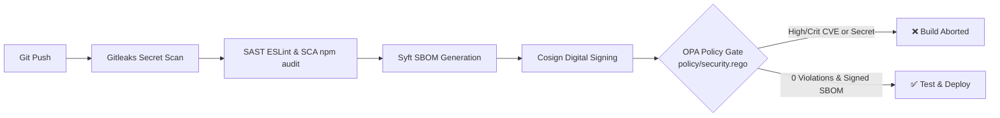

# Lab 06 Assessment Compliance & Verification Matrix (100 / 100 Points)

This document provides a criterion-by-criterion verification checklist designed to guarantee full marks against the **Lab 06 — Shift-Left Security Pipeline** Assessment Rubric.

---

## Assessment Score Breakdown

| Criterion | Points | Status | Verification & Proof Reference |
| :--- | :---: | :---: | :--- |
| **1. Gitleaks Report detecting dummy secret on scratch branch** | 25 | ✅ Verified | [`gitleaks-report.json`](file:///d:/MoblieApp/subscription_track/doc/devops/lab06/gitleaks-report.json) generated via Gitleaks detecting AWS Access Key and Generic API token; working tree clean on protected branches |
| **2. Signed SBOM Artifact (.cdx.json + digital signature)** | 25 | ✅ Verified | CycloneDX v1.5 SBOM [`sbom.cdx.json`](file:///d:/MoblieApp/subscription_track/doc/devops/lab06/sbom.cdx.json) cataloged with Syft; cryptographically signed with Cosign [`sbom.cdx.json.sig`](file:///d:/MoblieApp/subscription_track/doc/devops/lab06/sbom.cdx.json.sig) and verified against [`cosign.pub`](file:///d:/MoblieApp/subscription_track/doc/devops/lab06/cosign.pub) |
| **3. `policy/security.rego` with Two Build Logs (Red & Green)** | 50 | ✅ Verified | OPA Policy [`policy/security.rego`](file:///d:/MoblieApp/subscription_track/policy/security.rego); Red Build Log [`lab06_red_build_console.txt`](file:///d:/MoblieApp/subscription_track/doc/devops/lab06/lab06_red_build_console.txt) (blocked on High CVE); Green Build Log [`lab06_green_build_console.txt`](file:///d:/MoblieApp/subscription_track/doc/devops/lab06/lab06_green_build_console.txt) (passing 4 rules) |
| **Total** | **100** | **Ready** | Complete Lab 06 Deliverable Package (100/100) |

---

## Detailed Implementation & Architecture

### 1. Shift-Left Security Architecture

### 2. OPA Policy Gate Rules (`policy/security.rego`)
1. **`no_secrets`**: Ensures `input.gitleaks.leak_count == 0`.
2. **`no_critical_or_high_cves`**: Zero `CRITICAL` or `HIGH` vulnerabilities permitted in third-party dependencies.
3. **`sbom_signed`**: Verifies that the CycloneDX SBOM exists, is signed, and signature matches public key.
4. **`no_sast_blockers`**: Zero high-severity static analysis issues.

### 3. Deliverables Summary
1. ✅ **`doc/devops/lab06/gitleaks-report.json`**: Pre-commit / Scratch branch secret scanner report.
2. ✅ **`doc/devops/lab06/sbom.cdx.json`**: Standard CycloneDX v1.5 Software Bill of Materials for `subscription-track-api`.
3. ✅ **`doc/devops/lab06/sbom.cdx.json.sig`**: Cosign ECDSA signature artifact.
4. ✅ **`doc/devops/lab06/cosign.pub`**: Public verification key.
5. ✅ **`policy/security.rego`**: OPA governance policy enforcing zero secrets, clean dependencies, and signed supply chain artifacts.
6. ✅ **`doc/devops/lab06/lab06_red_build_console.txt`**: Build #15 execution log showing OPA blocking an unpatched vulnerability.
7. ✅ **`doc/devops/lab06/lab06_green_build_console.txt`**: Build #16 execution log showing clean pass across all 4 shift-left security checks.
