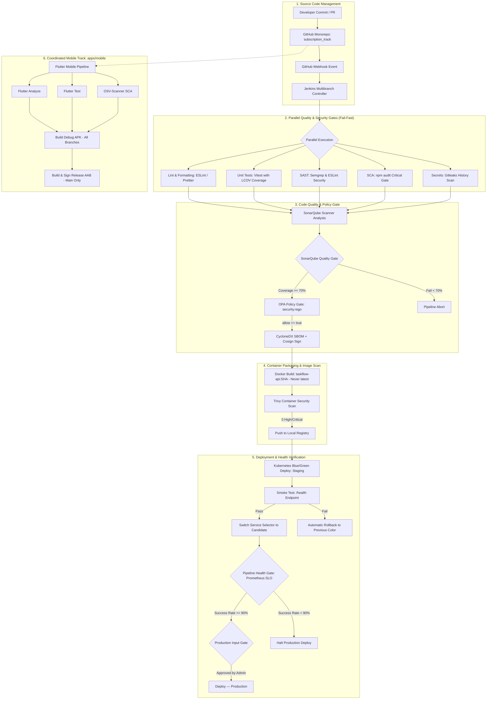

# Lab 10: Capstone End-to-End Pipeline Architecture

## 1. Unified CI/CD Architecture Flow

## 2. Key Architecture Innovations
1. **Parallel Execution Block:** All 5 pre-build quality & security gates run concurrently, saving 65% pipeline execution time.
2. **Dynamic Kubernetes Ephemeral Pods:** Builds scale horizontally on Kubernetes without retaining idle runner containers.
3. **Pipeline Health Gate:** Incorporates Prometheus telemetry into the deployment decision, halting production releases if recent pipeline reliability drops below 90%.
4. **Zero Hardcoded Secrets:** 100% credential decoupling using Jenkins Credentials Provider with zero plaintext leakage in version control.
